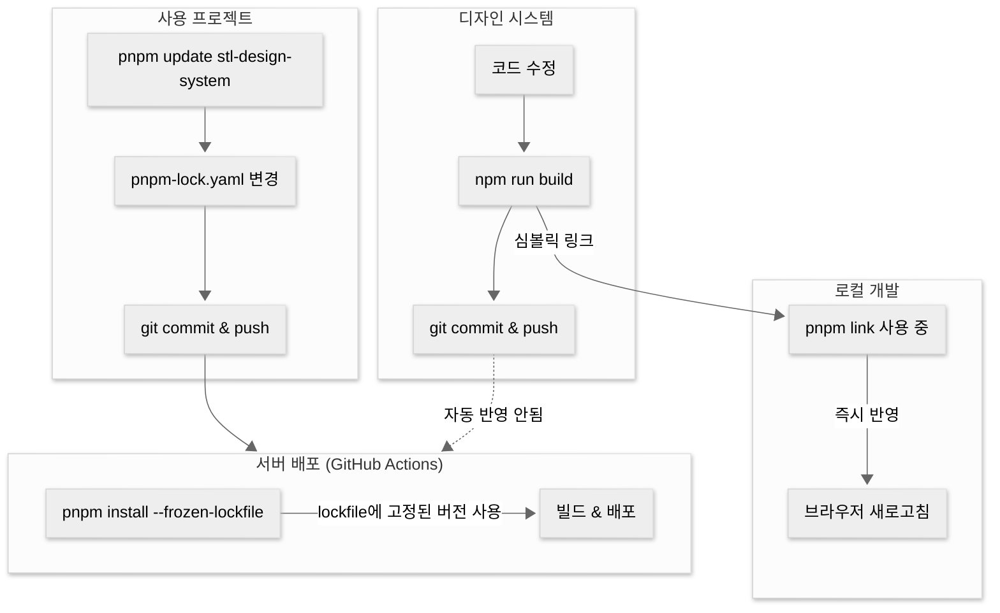

# STL Design System 적용 가이드

## 요구사항

디자인 시스템을 사용하기 전에 다음 요구사항을 확인하세요.

| 패키지            | 버전 | 필수 |
| ----------------- | ---- | ---- |
| Node.js           | 20+  | O    |
| React             | 18.x | O    |
| Tailwind CSS      | 4.x  | O    |
| @tailwindcss/vite | 4.x  | O    |

> **주의**: React 19는 아직 지원하지 않습니다. 반드시 React 18.x를 사용하세요.

---

## 1. 설치

### package.json에 추가

```json
{
  "dependencies": {
    "stl-design-system": "git+https://github.com/start-today-stl/stl-design-system.git"
  }
}
```

그 후 설치:

```bash
# npm
npm install

# pnpm
pnpm install
```

### CLI로 직접 설치

```bash
# npm
npm install git+https://github.com/start-today-stl/stl-design-system.git

# pnpm
pnpm add git+https://github.com/start-today-stl/stl-design-system.git
```

### 로컬 개발 (link)

디자인 시스템을 수정하면서 바로 테스트하고 싶다면 link를 사용하세요:

**pnpm 사용 시 (권장):**

```bash
# 사용할 프로젝트에서
cd my-project
pnpm link /path/to/stl-design-system
```

**npm 사용 시:**

```bash
# 1. 디자인 시스템 프로젝트에서 (1회)
cd stl-design-system
npm link

# 2. 사용할 프로젝트에서
cd my-project
npm link stl-design-system
```

이후 워크플로우:

1. 디자인 시스템에서 코드 수정
2. `npm run build` 실행
3. 사용 프로젝트에서 바로 반영됨 (dev 서버 새로고침만 하면 됨)

> **주의**: `pnpm install` 또는 `pnpm update` 실행 시 link가 해제됩니다. 의존성 재설치 후에는 다시 link 명령어를 실행하세요.

### 업데이트 반영 흐름



| 환경 | 반영 시점                    |
| ---- | ---------------------------- |
| 로컬 | 디자인 시스템 빌드 즉시      |
| 서버 | lockfile 업데이트 후 배포 시 |

---

## 2. CSS 설정 (필수)

프로젝트의 메인 CSS 파일 (예: `src/index.css`)에 **반드시** 다음 3줄을 추가해야 합니다:

```css
@import "tailwindcss";
@import "stl-design-system/tokens";
@source "../node_modules/stl-design-system/dist";
```

### 각 줄의 역할

| 코드                                 | 역할                             | 누락 시 문제            |
| ------------------------------------ | -------------------------------- | ----------------------- |
| `@import "tailwindcss"`              | Tailwind CSS 로드                | 모든 스타일 미적용      |
| `@import "stl-design-system/tokens"` | 디자인 토큰 (색상, 폰트 등) 로드 | 커스텀 색상/폰트 미적용 |
| `@source "..."`                      | 디자인 시스템 클래스 스캔        | 컴포넌트 스타일 미적용  |

### @source 경로 주의사항

`@source` 경로는 **CSS 파일 위치 기준 상대경로**입니다.

```
프로젝트/
├── src/
│   └── index.css    ← 여기서 @source 작성
└── node_modules/
    └── stl-design-system/
        └── dist/    ← 여기를 가리켜야 함
```

CSS 파일 위치에 따라 경로가 달라집니다:

| CSS 파일 위치          | @source 경로                                          |
| ---------------------- | ----------------------------------------------------- |
| `src/index.css`        | `@source "../node_modules/stl-design-system/dist"`    |
| `src/styles/index.css` | `@source "../../node_modules/stl-design-system/dist"` |
| `styles/main.css`      | `@source "../node_modules/stl-design-system/dist"`    |

### 왜 @source가 필요한가?

Tailwind CSS v4는 `node_modules` 폴더를 기본적으로 스캔하지 않습니다. `@source`로 명시적으로 포함시켜야 디자인 시스템 컴포넌트의 Tailwind 클래스가 CSS로 생성됩니다.

> 참고: [Tailwind CSS 공식 문서 - Detecting classes in source files](https://tailwindcss.com/docs/detecting-classes-in-source-files)

---

## 3. Vite 설정 (필수)

`vite.config.ts`에 `@tailwindcss/vite` 플러그인을 추가해야 합니다:

```ts
import { defineConfig } from "vite";
import react from "@vitejs/plugin-react";
import tailwindcss from "@tailwindcss/vite";

export default defineConfig({
  plugins: [react(), tailwindcss()],
});
```

> **주의**: `@tailwindcss/vite`가 없으면 CSS의 `@import "tailwindcss"`가 처리되지 않습니다.

---

## 4. 적용 체크리스트

설정 완료 후 다음을 확인하세요:

- [ ] `stl-design-system` 설치 완료
- [ ] React 버전이 18.x인가? (`npm list react`로 확인)
- [ ] Tailwind CSS 버전이 4.x인가? (`npm list tailwindcss`로 확인)
- [ ] `@tailwindcss/vite` 설치됨?
- [ ] `vite.config.ts`에 `tailwindcss()` 플러그인 추가됨?
- [ ] CSS 파일에 `@import "tailwindcss"` 있음?
- [ ] CSS 파일에 `@import "stl-design-system/tokens"` 있음?
- [ ] CSS 파일에 `@source "../node_modules/stl-design-system/dist"` 있음?
- [ ] `@source` 경로가 CSS 파일 위치 기준으로 올바른가?

---

## 5. 컴포넌트 사용

### 기본 컴포넌트

```tsx
import { Button, Input, Badge } from "stl-design-system";

function App() {
  return (
    <div className="p-4 flex flex-col gap-4">
      <Button variant="primary">주요 액션</Button>
      <Button variant="ghost">기본 버튼</Button>
      <Button variant="danger">삭제</Button>
      <Button variant="success">완료</Button>

      <Input placeholder="입력하세요" />
      <Input state="error" placeholder="에러 상태" />

      <div className="flex gap-2">
        <Badge variant="info-light">정보</Badge>
        <Badge variant="success-light">성공</Badge>
        <Badge variant="danger-light">위험</Badge>
      </div>
    </div>
  );
}
```

### 레이아웃 컴포넌트

```tsx
import {
  AppShell,
  NavGroup,
  NavItem,
  SearchBar,
  SolidHomeIcon,
  SolidSettingIcon,
} from "stl-design-system";

function Layout({ children }) {
  return (
    <AppShell>
      <AppShell.Sidebar>
        <NavGroup icon={SolidHomeIcon} label="메인" defaultExpanded>
          <NavItem label="홈" active />
          <NavItem label="대시보드" />
        </NavGroup>
        <NavGroup icon={SolidSettingIcon} label="설정">
          <NavItem label="일반" />
          <NavItem label="알림" />
        </NavGroup>
      </AppShell.Sidebar>

      <AppShell.Header
        search={<SearchBar placeholder="검색어를 입력하세요" />}
      />

      <AppShell.Content>{children}</AppShell.Content>
    </AppShell>
  );
}
```

---

## 6. 문제 해결

### 스타일이 전혀 적용되지 않음

1. `vite.config.ts`에 `tailwindcss()` 플러그인이 있는지 확인
2. CSS 파일에 `@import "tailwindcss"` 있는지 확인
3. Vite 개발 서버 재시작 (`npm run dev`)

### 버튼/인풋 등 컴포넌트 스타일만 안 됨

1. `@source` 디렉티브가 있는지 확인
2. `@source` 경로가 올바른지 확인 (CSS 파일 위치 기준 상대경로)
3. Vite 개발 서버 재시작

### 색상이 이상함 (primary 색상 등)

1. `@import "stl-design-system/tokens"` 있는지 확인
2. 순서 확인: `@import "tailwindcss"` → `@import "stl-design-system/tokens"` 순서여야 함

### 디자인 시스템 업데이트 후 반영 안 됨

**link 사용 시:**

```bash
# 디자인 시스템에서 빌드만 하면 됨
cd stl-design-system
npm run build
```

**Git URL 설치 사용 시:**

```bash
# pnpm
rm -rf node_modules/.cache node_modules/stl-design-system
pnpm install

# npm
rm -rf node_modules/.cache node_modules/stl-design-system
npm install
```

그리고 Vite 개발 서버 재시작

### TypeScript 타입 에러

`tsconfig.json`에서 `moduleResolution`이 `bundler`인지 확인:

```json
{
  "compilerOptions": {
    "moduleResolution": "bundler"
  }
}
```

### React 버전 충돌

```
npm error ERESOLVE could not resolve
```

React 19가 설치된 경우 발생합니다. React 18로 다운그레이드하세요:

```bash
# pnpm
pnpm add react@18 react-dom@18

# npm
npm install react@18 react-dom@18
```
